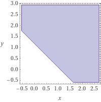

# 1주차 결과보고서

### 최종 결과의 2차원 직선 그래프 


0.69x+0.63y-0.74>0

```bash
0       0       GOOD
0       0       GOOD
0       0       GOOD
1       1       GOOD
bias :  0.74
weight 0:       0.69
weight 1:       0.63
```

### 어떤 값을 입력해야 무한 loop에서 빨리 나올 수 있는가?
and 게이트역할을 할 수 있는 노드는 다음을 만족해야한다.

 1. 음의 방향성을 가지며
 2. (1, 1) 아래를 지나며
 3. (1, 0) 과 (0, 1) 위를 지난다.

위 세가지를 만족하도록 weight 값과 bias 값의 범위를 한정지으면 (예시: w1, w2 부호가 같으며 같은값을 가지게) 좀 더 빠르게 결과를 도출해 낼 수 있다.

