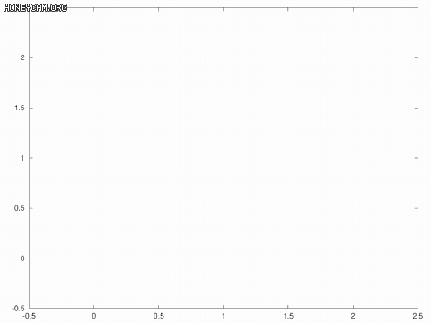
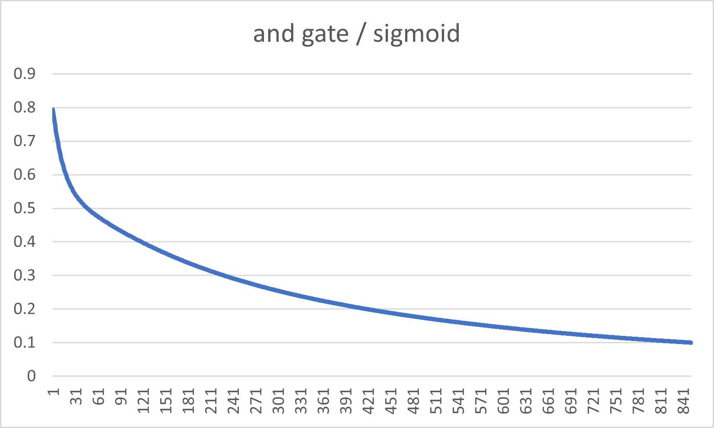
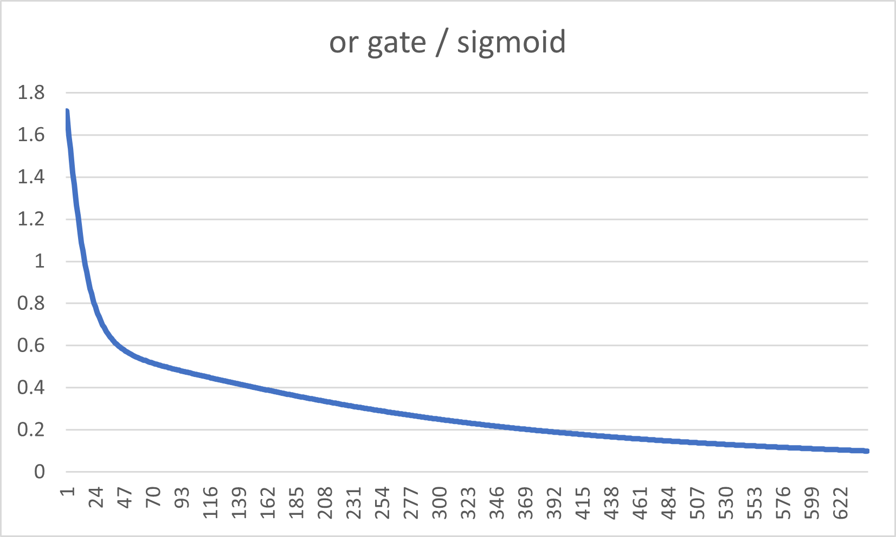
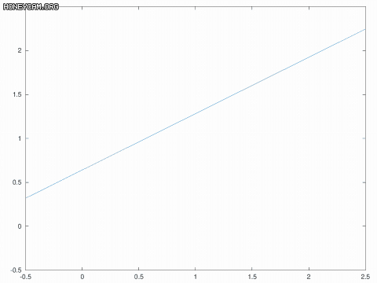
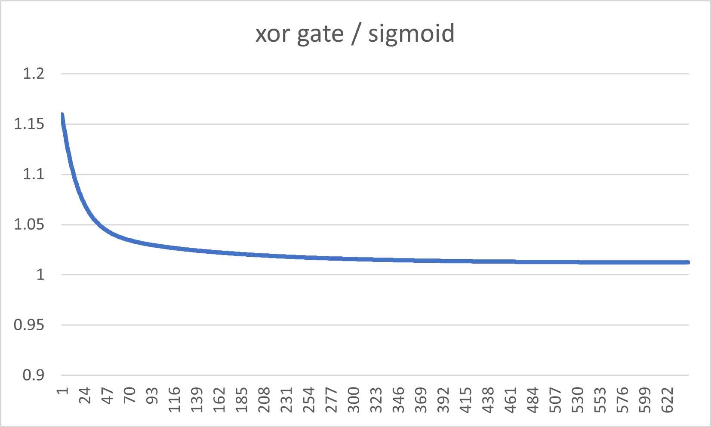

## 과제 #2 입력이 n차원인 perceptron learning 구현

## meta

| 제목       | 내용                                                        |
| ---------- | ----------------------------------------------------------- |
| 작성자     | 2016920036 컴퓨터과학부 이완해                              |
| 실행환경   | Linux 5.4.0-48-generic / gcc version 8.3.0 (Debian 8.3.0-6) |
| 개발환경   | vscode + c/c++ plugin (.vscode 이하 내용 참조)              |
| 컴파일방법 | g++ -g *.cpp -o main                                        |
| 결과물     | ./main                                                      |

## 결과 보고서

유의미한 오류 변화율을 측정하기위해 Activation function은 Sigmoid 함수를 사용하였고, 이 함수에 대한 정의는 `main.cpp`에 다음과 같이 정의가 되어있다.

```cpp
// Sigmoid와 Derivative of the Sigmoid 함수
auto f = [](double x) -> double { return 1 / (1 + std::exp(-x)); };
auto devf = [](double x) -> double { auto f = [](double x) -> double { return 1 / (1 + std::exp(-x)); }; return f(x)*(1-f(x)); };
```

학습과정 그래프 변화는 매 iteration 마다 현재 노드상태를 수식상태로 뽑아낸 후 gnu octave 를 통해 시각화 하였다. 세부적인 코드는 [여기](./report/plot.m)서 확인 가능하다.

### AND Gate

* 학습과정 그래프 변화

  

* Iteration에 따른 오류 변화

  

### OR Gate

* 학습과정 그래프 변화

  

* Iteration에 따른 오류 변화

  
  
### XOR Gate

* 학습과정 그래프 변화

  

* Iteration에 따른 오류 변화

  
  
* 분석

  * 미리 예상했던바와같이 단일노드로는 XOR Gate 학습에 실패하였다.
  * 단, 어떤 형태의 오류가 최소화된 그래프형태로 금방 고정될것이라는 예상과는 다르게 시계방향으로 계속 변화하는것을 확인할 수 있었으며 최종적으로는 `0.02x + 0.01y = 0.01` 형태의 그래프로 수렴하긴 했으나 오류에 큰 변화가 없음에도 꽤 긴 시간동안 지속적으로 그래프가 변화하는것을 확인할 수 있다.