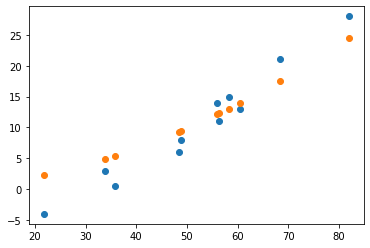

## 과제 #4 w2 * t_u ** 2 + w1 * t_u + b

## meta

| 제목     | 내용                                  |
| -------- | ------------------------------------- |
| 작성자   | 2016920036 컴퓨터과학부 이완해        |
| 실행환경 | Linux 5.4.0-51-generic / Python 3.8.3 |
| 개발환경 | conda 4.8.3 / torch==1.6.0            |

## 결과 보고서

* 파란점 -> 원본값
* 주황점 -> 추론값

